

    

    <b style="font-size: 35px;">Tracko</b>
     
    A habit tracking app

In my application, I offer a comprehensive feature set designed to enhance the user experience. Users can seamlessly authenticate and register, manage habits with flexibility, and personalize their organization using labels and folders. Intuitive sorting and a dedicated focus mode optimize productivity, while a habit activity heatmap promotes self-awareness. The interface is sleek and user-friendly, and I employ <b>state management with Provider</b>, leverage <b>Firebase for authentication and cloud storage</b>, and utilize <b>Hive for efficient local storage</b>.

    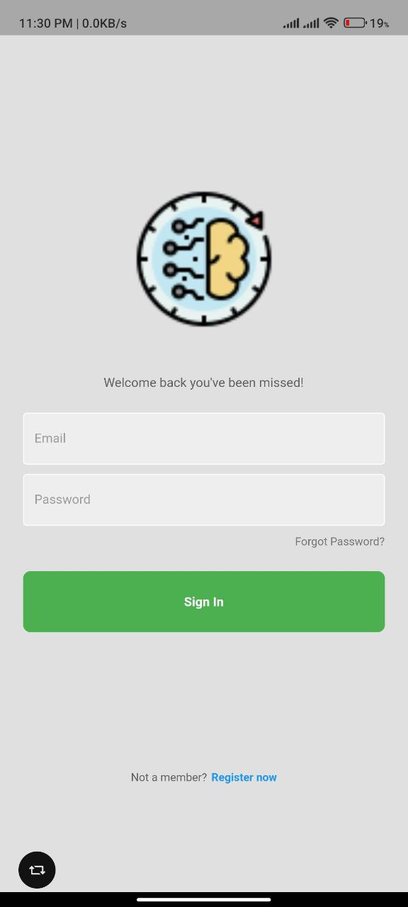
    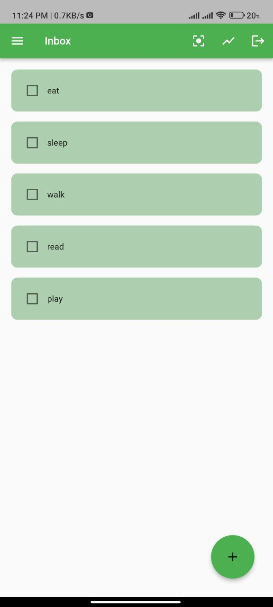
    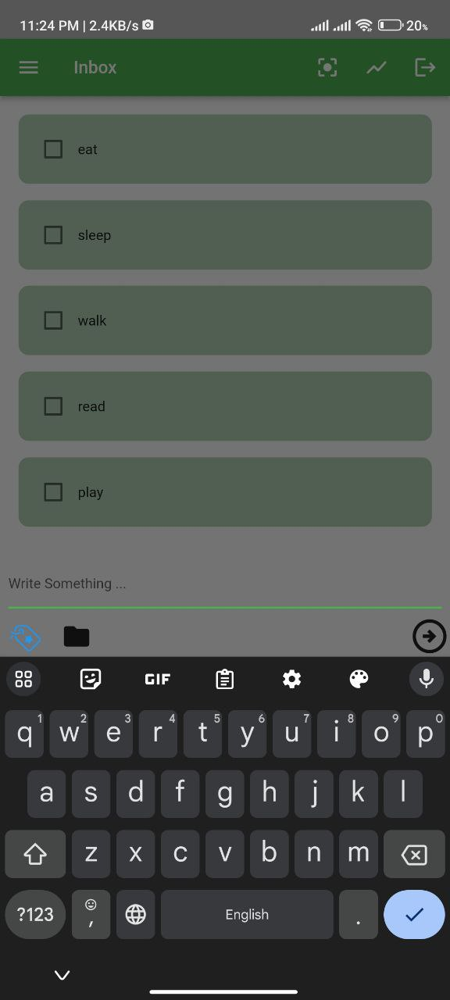

    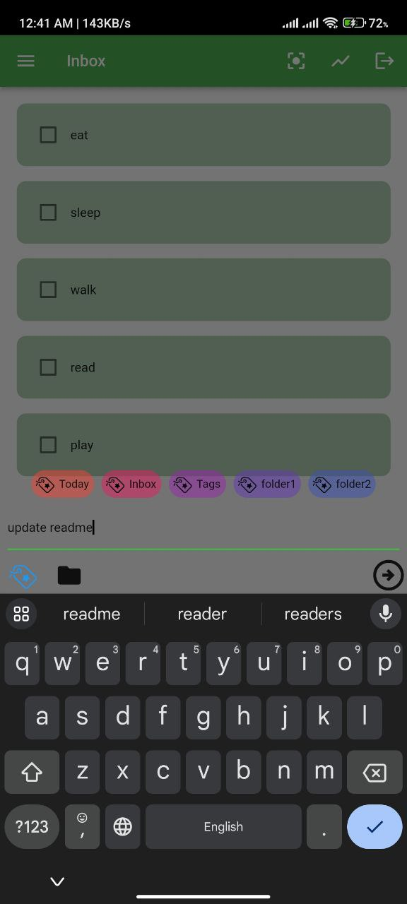
    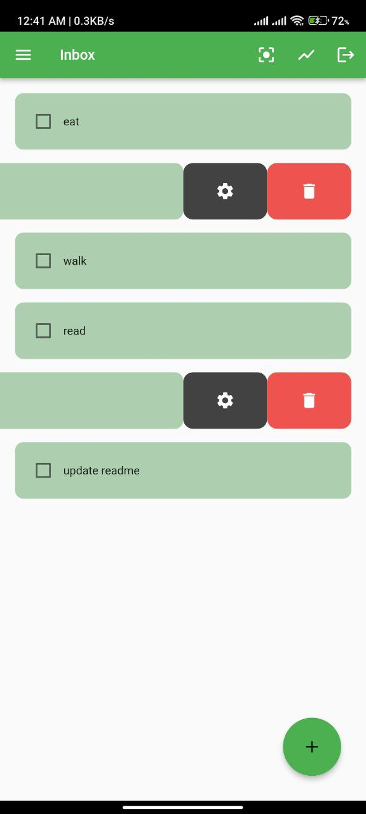
    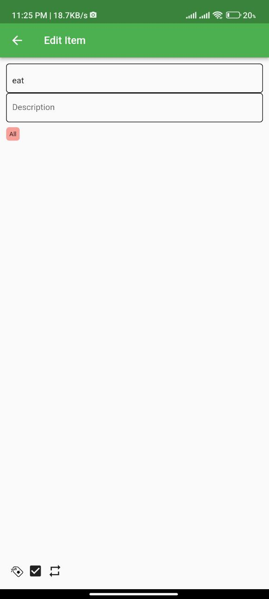

    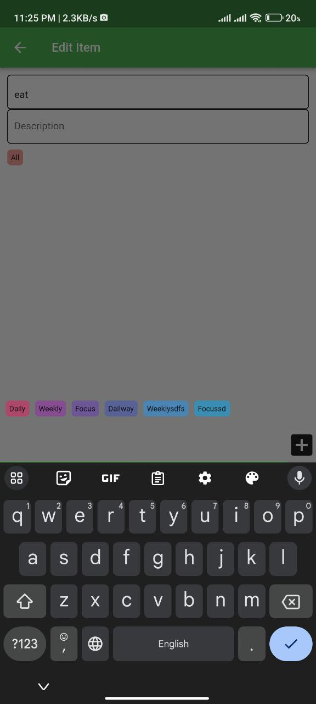
    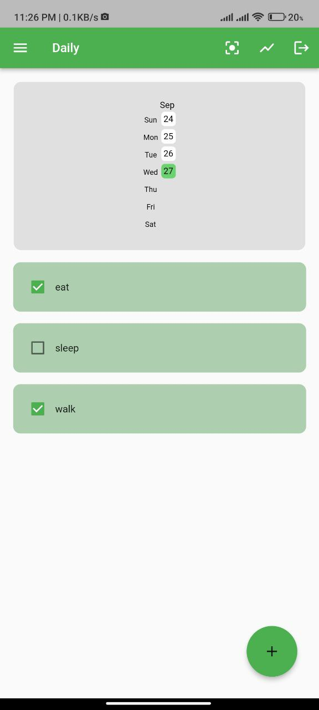
    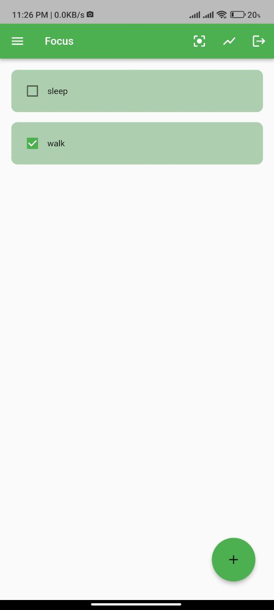

    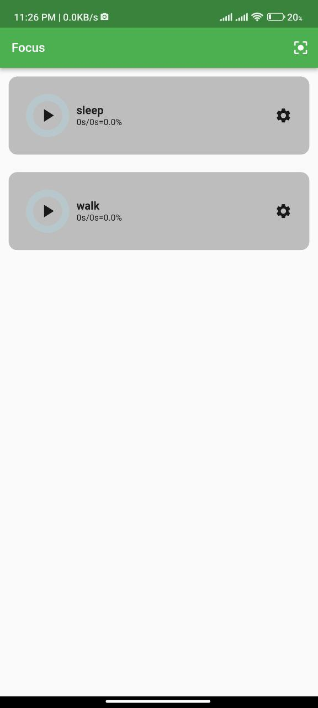
    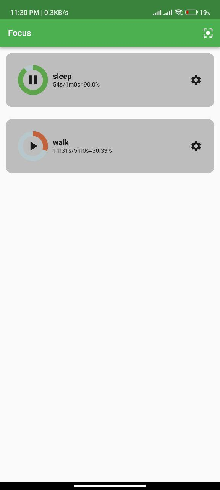
    <!--  -->

## Features

- **User Authentication and Registration**
- Effortlessly manage user access with secure login and registration functionality, ensuring a personalized experience.

- **Robust Habit Management**
- Empower users to create and manage an extensive list of habits, enabling them to cultivate a multitude of positive
  behaviors.

- **Flexible Labeling and Folder Organization**
- Facilitate efficient organization by providing users with the ability to apply distinct labels and create custom
  folders for their habits.

- **Customizable Habit Labeling and Folder Assignment**
- Allow users to assign specific labels or move habits to various folders, tailoring their organization to their unique
  preferences.

- **Intuitive Habit Sorting**
- Enable users to effortlessly sort and view their habits either by labels or folders, optimizing their organization and
  productivity.

- **Focus Mode for Task Tracking**
- Enhance user productivity with a dedicated focus mode, enabling precise tracking of habit duration and task
  performance.

- **Habit Activity Heatmap**
- Provide users with an insightful heatmap system to visually track their habit activity over time, fostering
  self-awareness and motivation.

- **Sleek and User-Friendly Interface**
- Deliver a smooth and visually appealing user interface, ensuring a seamless and enjoyable user experience.

[Download tracko](tracko.apk)
